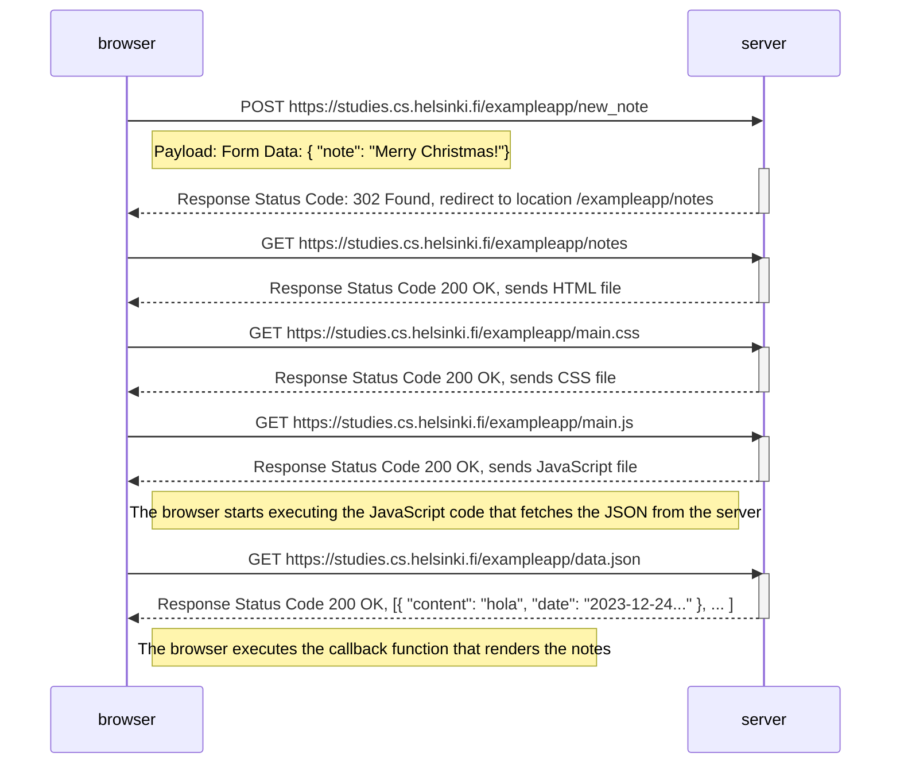

```mermaid
sequenceDiagram
    participant browser
    participant server

    browser->>server: POST https://studies.cs.helsinki.fi/exampleapp/new_note

    Note right of browser: Payload: Form Data: { "note": "Merry Christmas!"}
    activate server

    server-->>browser: Response Status Code: 302 Found, redirect to location /exampleapp/notes
    deactivate server

    browser->>server: GET https://studies.cs.helsinki.fi/exampleapp/notes
    activate server
    server-->>browser: Response Status Code 200 OK, sends HTML file
    deactivate server

    browser->>server: GET https://studies.cs.helsinki.fi/exampleapp/main.css
    activate server
    server-->>browser: Response Status Code 200 OK, sends CSS file
    deactivate server

    browser->>server: GET https://studies.cs.helsinki.fi/exampleapp/main.js
    activate server
    server-->>browser: Response Status Code 200 OK, sends JavaScript file
    deactivate server

     Note right of browser: The browser starts executing the JavaScript code that fetches the JSON from the server

    browser->>server: GET https://studies.cs.helsinki.fi/exampleapp/data.json
    activate server
    server-->>browser: Response Status Code 200 OK, [{ "content": "hola", "date": "2023-12-24..." }, ... ]
    deactivate server

    Note right of browser: The browser executes the callback function that renders the notes
```