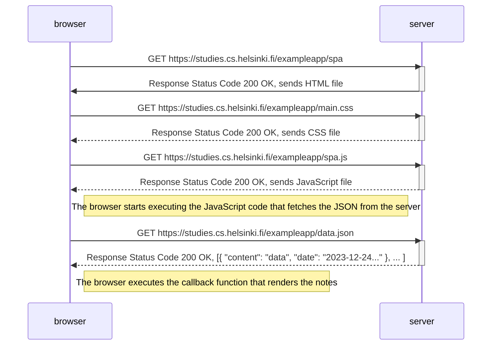

```mermaid
sequenceDiagram
    participant browser
    participant server

    browser->>server: GET https://studies.cs.helsinki.fi/exampleapp/spa
    activate server

    server->>browser: Response Status Code 200 OK, sends HTML file
    deactivate server

    browser->>server: GET https://studies.cs.helsinki.fi/exampleapp/main.css
    activate server
    server-->>browser: Response Status Code 200 OK, sends CSS file
    deactivate server

    browser->>server: GET https://studies.cs.helsinki.fi/exampleapp/spa.js
    activate server
    server-->>browser: Response Status Code 200 OK, sends JavaScript file
    deactivate server

     Note right of browser: The browser starts executing the JavaScript code that fetches the JSON from the server

    browser->>server: GET https://studies.cs.helsinki.fi/exampleapp/data.json
    activate server
    server-->>browser: Response Status Code 200 OK, [{ "content": "data", "date": "2023-12-24..." }, ... ]
    deactivate server

    Note right of browser: The browser executes the callback function that renders the notes
```