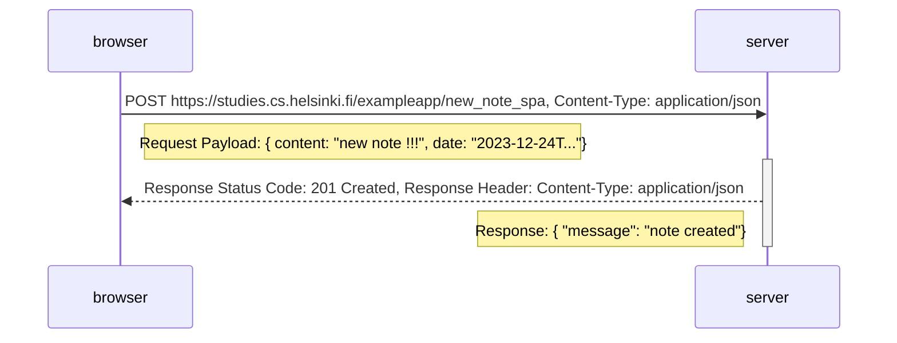

```mermaid
sequenceDiagram
    participant browser
    participant server

    browser->>server: POST https://studies.cs.helsinki.fi/exampleapp/new_note_spa, Content-Type: application/json

    Note right of browser: Request Payload: { content: "new note !!!", date: "2023-12-24T..."} 
    activate server

    server-->>browser: Response Status Code: 201 Created, Response Header: Content-Type: application/json

    Note left of server: Response: { "message": "note created"}
    deactivate server
```